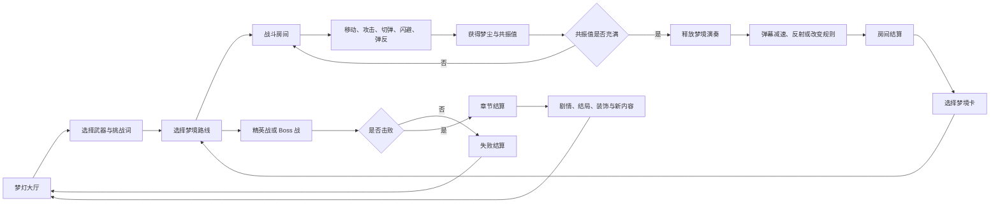

# 《梦潮：回声航线》核心玩法需求文档

版本：v0.1

项目类型：2D 手绘横版弹幕动作 Roguelite

目标平台：Steam、Windows、Android、iOS

## 1. 一句话概念

玩家操控梦灯生物穿越失控的梦境，通过移动、射击、近战切弹和完美弹反积累“共振值”，释放“梦境演奏”改变弹幕和关卡规则，最终击败由负面情绪形成的 Boss。

## 2. 核心体验目标

玩家在每局游戏中应该持续感受到三件事：

1. 躲避弹幕时有紧张感。
2. 主动接近、切断和反弹弹幕时有爽感。
3. 选择梦境卡后，当前关卡规则发生明显变化。

核心宣传句：

> 把敌人的弹幕弹回去，编成自己的梦境音乐。

## 3. 核心玩法循环

## 4. 玩家基础操作

### Steam

- WASD 或方向键：移动
- 鼠标：瞄准
- 鼠标左键：远程攻击
- 鼠标右键：近战切弹
- 空格：闪避
- Shift：梦境演奏
- 手柄：完整支持

### 手机

- 左侧虚拟摇杆：移动
- 右侧拖动区域：瞄准
- 普通攻击：可自动瞄准
- 近战按钮：切断弹幕
- 闪避按钮：位移与无敌帧
- 技能按钮：释放梦境演奏
- 支持自动开火、辅助瞄准和按钮自定义

## 5. 战斗系统

### 5.1 远程攻击

玩家使用装备的武器持续发射攻击。

远程攻击负责：

- 稳定输出
- 处理远距离敌人
- 触发敌人的弱点
- 在安全位置积累资源

### 5.2 近战切弹

近战攻击在主角前方形成短距离弧形攻击区域。

效果：

- 切断指定类型的敌方弹幕
- 将部分弹幕转化为友方投射物
- 对近距离敌人造成高额伤害
- 成功切弹后增加共振值

近战攻击需要承担风险，攻击范围较短，不能完全替代远程攻击。

### 5.3 闪避

闪避提供短距离位移和短时间无敌。

闪避规则：

- 默认拥有 2 次充能
- 充能可通过时间恢复或特殊卡牌恢复
- 完美闪避会额外增加共振值
- 闪避不能穿过 Boss 身体，只能穿过弹幕和部分敌人攻击

### 5.4 完美弹反

玩家在弹幕进入判定窗口时使用近战或特殊防御动作，可以将弹幕反射回敌人。

弹反分为三档：

- 普通弹反：抵消弹幕
- 精准弹反：反射弹幕并获得共振值
- 完美弹反：反射强化弹幕并触发短暂时间减速

## 6. 共振值与梦境演奏

### 共振值来源

- 擦弹
- 完美闪避
- 近战切弹
- 精准弹反
- 连续击杀
- Boss 弱点攻击

### 梦境演奏效果

共振值充满后，玩家可以释放一次梦境演奏。

首发建议制作四种效果：

1. **时间回声**：全屏敌方弹幕减速 60%。
2. **旋律反射**：场内部分弹幕转化为友方音符攻击。
3. **重力倒置**：场景重力翻转，敌人和弹幕改变运动方向。
4. **梦境静止**：普通敌人冻结，Boss 暴露短时间弱点。

梦境演奏必须有明显的画面变化、音乐变化和控制反馈，让玩家一眼看出规则已经改变。

## 7. 弹幕类型

| 类型 | 颜色 | 交互方式 | 主要作用 |
|---|---|---|---|
| 普通弹幕 | 粉色 | 躲避 | 基础威胁 |
| 可切弹幕 | 蓝色 | 近战切断 | 鼓励主动接近 |
| 可反弹弹幕 | 金色 | 精准弹反 | 高风险高回报 |
| 预警弹幕 | 白色 | 观察后躲避 | 提示 Boss 技能 |
| 梦尘弹幕 | 紫色 | 吸收或收集 | 提供资源 |

颜色只是辅助信息，必须同时使用形状、速度和特效区分，避免色盲玩家无法判断。

## 8. 武器系统

首发制作 4 种武器，采用玩法差异而不是单纯数值差异。

### 光针炮

- 远距离高速直线攻击
- 适合新手
- 擦弹奖励较低

### 梦刃

- 近战范围大
- 切弹能力强
- 需要贴近敌人

### 风筝弓

- 发射会绕场飞行的攻击
- 适合走位和预判
- 单次命中伤害较高

### 影子铃

- 攻击会延迟爆炸
- 适合提前布置
- 对移动型敌人要求较高

## 9. 梦境路线

每局通过路线图选择下一个节点。

节点类型：

- 普通战斗
- 精英战斗
- Boss 战
- 梦境事件
- 商店
- 恢复房间
- 挑战房间

路线选择要让玩家在“安全成长”和“高风险高收益”之间做决定。

## 10. 梦境卡系统

每完成一个战斗房间，玩家从 3 张梦境卡中选择 1 张。

梦境卡改变玩法规则，不只增加攻击力。

### 示例卡牌

- **回声**：敌方弹幕 2 秒后重复一次。
- **潮汐**：场景重力每 10 秒翻转。
- **温柔**：近距离击杀恢复生命，但敌人数量增加。
- **失焦**：敌人本体隐藏，只显示攻击预警。
- **倒带**：受到致命伤害时回到 5 秒前的位置，每局只能触发一次。
- **镜中人**：生成一个复制影子，复制玩家攻击并吸引敌人。

每张卡都需要同时包含：

- 规则变化
- 正面收益
- 负面代价
- 视觉表现
- 音乐层变化

## 11. 房间结算

战斗结束后显示：

- 击杀数
- 连击数
- 擦弹次数
- 弹反次数
- 受到伤害次数
- 获得梦尘
- 当前共振值
- 房间评价

结算页面不应打断节奏，手机端建议 2 秒内可跳过。

## 12. Boss 设计

每个 Boss 代表一种负面情绪，至少拥有三个战斗阶段。

### Boss 阶段结构

1. 第一阶段：学习型弹幕，帮助玩家理解攻击规律。
2. 第二阶段：加入情绪专属机制。
3. 第三阶段：改变场景规则，形成最终压力。

### 首发 Boss 示例

- 失控闹钟：攻击会根据时间刻度加速。
- 镜中兽：复制玩家最近使用的动作。
- 吞梦鲸灯：吞掉场景中的安全区域。
- 完美裁缝：剪断场景平台和弹幕路线。
- 黎明裂影：随机混合前面所有梦境规则。

## 13. 成长系统

永久成长重点放在增加选择，而不是无限提高伤害。

可解锁内容：

- 新武器
- 新梦境卡
- 新被动遗物
- 新剧情节点
- 新结局
- 主角外观
- 梦灯大厅装饰
- 音乐片段
- 挑战模式

建议避免通过大量刷低级关卡获得过高数值，否则会削弱弹幕游戏的挑战感。

## 14. 剧情与玩家行为

系统记录玩家的战斗倾向，并影响后续剧情。

记录维度：

- 是否经常近战
- 是否频繁闪避
- 是否选择高风险梦境卡
- 是否救助事件 NPC
- 是否追求无伤
- 是否主动收集梦尘

行为可以影响：

- NPC 对话
- 关卡分支
- Boss 台词
- 结局画面
- 隐藏房间

## 15. 首发内容规模

- 5 个梦境区域
- 6 个 Boss
- 30 种普通敌人
- 10 种精英敌人
- 4 种基础武器
- 24 张梦境卡
- 12 件被动遗物
- 5 个主要结局
- 3 个难度
- 20—30 个成就
- 每日挑战模式

首通时长建议为 3—4 小时，完整挑战和收集约 15—25 小时。

## 16. 双平台要求

### Steam

- Windows 首发
- 键鼠和手柄完整支持
- Steam 成就
- Steam Cloud
- Steam Deck 适配
- 免费 Demo
- 中文、英文、日文、韩文

### 手机

- 横屏优先
- 适配 16:9、19.5:9、平板和折叠屏
- 中低端设备保持 30 FPS
- 高端设备目标 60 FPS
- 支持手柄
- 支持按钮布局自定义
- 支持自动攻击和辅助瞄准
- 支持中低特效模式

## 17. MVP 版本范围

第一版只验证核心手感，不制作完整内容。

### MVP 必须包含

- 1 个梦境区域
- 1 个 Boss
- 5 种普通敌人
- 2 种武器
- 6 张梦境卡
- 移动
- 远程攻击
- 近战切弹
- 闪避
- 弹反
- 共振值
- 梦境演奏
- Steam 键鼠和手柄
- 手机触控基础操作

### MVP 验收标准

1. 玩家可以在 30 秒内理解移动和攻击。
2. 玩家可以看懂普通弹幕和可切弹幕的区别。
3. 近战切弹成功时有明确的命中反馈。
4. 共振值充满后，梦境演奏能明显改变战场。
5. 玩家失败后愿意再次挑战。
6. 一轮体验可以控制在 8—15 分钟。

## 18. 开发优先级

### P0：必须完成

- 移动与瞄准
- 远程攻击
- 近战切弹
- 闪避与弹反
- 弹幕碰撞
- 共振值
- 梦境演奏
- 普通敌人
- Boss 基础阶段
- 房间结算

### P1：首发增强

- 梦境卡
- 分支路线
- 事件房间
- 多阶段 Boss
- 剧情结局
- 永久成长
- Steam 成就

### P2：后续扩展

- 梦境种子分享
- 每日排行榜
- 15 秒精彩回放
- 本地双人协奏
- 梦灯大厅装饰
- 玩家自定义梦境

## 19. 性能和可读性规则

- 弹幕采用对象池。
- 统一弹幕颜色、形状和速度规则。
- 同屏弹幕设置上限。
- 粒子特效提供高、中、低三档。
- 提供减少屏幕闪烁和减少弹幕特效选项。
- 主角碰撞体必须小于角色视觉范围。
- Boss 预警必须提前显示。
- 不允许特效遮挡玩家和关键弹幕。

## 20. 后续制作顺序

1. 完成移动、射击和闪避原型。
2. 加入近战切弹和弹反。
3. 完成第一种弹幕和一个小 Boss。
4. 加入共振值和梦境演奏。
5. 制作一张完整垂直切片关卡。
6. 同时测试 Steam 手柄和手机触控。
7. 根据测试结果调整弹幕速度、判定窗口和镜头范围。
8. 再扩充梦境卡、路线和剧情。

