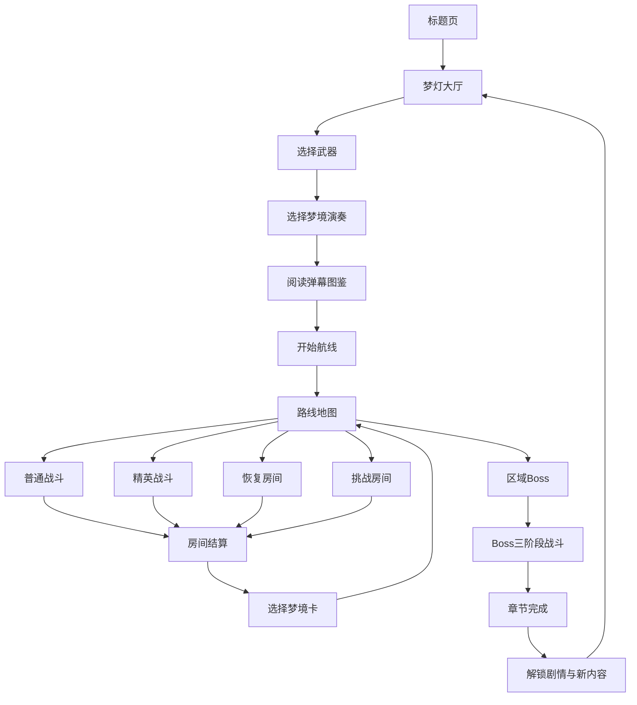

# 梦潮 回声航线 详细玩法设计文档

版本：v0.2

文档用途：玩法立项、程序拆分、美术拆分、原型验收、数值测试

目标平台：Steam、Windows、Android、iOS

类型：2D 手绘横版弹幕动作 Roguelite

参考原型：Q版子弹地狱游戏 Artifact 版本

## 0. 本版本的设计结论

本版本保留原型中已经形成的核心表达：

- 主角是可爱的梦灯生物。
- 玩家通过移动、自动瞄准射击、切弹、弹反和闪避完成战斗。
- 粉色圆弹、蓝色菱形弹、金色星弹和紫色梦尘具有不同交互规则。
- 共振值满后使用梦境演奏。
- 房间结束后选择一张梦境卡。
- 通过普通战斗、精英战、恢复房间、挑战房间和 Boss 战组成一条梦境航线。
- Boss 采用三个乐章或三个阶段逐步提高压力。

本版本重点解决原型中容易出现的几个问题：

1. 新玩家进入后必须在 30 秒内知道移动、攻击、切弹和闪避分别做什么。
2. 所有弹幕必须通过颜色、形状、声音和文字共同区分，不能只依赖颜色。
3. 梦境演奏必须改变战场规则，而不是只播放一次大招特效。
4. 梦境卡必须同时提供收益和代价，形成可理解的构筑选择。
5. 房间结算和路线选择不能拖慢战斗节奏。
6. 手机触控和 Steam 键鼠、手柄必须从同一套逻辑设计，而不是后期强行移植。

## 1. 产品定义

### 1.1 一句话卖点

把敌人的弹幕弹回去，编成自己的梦境音乐。

### 1.2 玩家身份

玩家操控一只从第一盏梦灯中诞生的梦灯生物。它没有传统武器库，而是通过吸收和改写梦境中的攻击来成长。

### 1.3 主要目标

玩家需要穿越五个梦境区域，收集“梦尘”，完成区域 Boss 战，并找回失落的第一盏梦灯。每次游玩都可以选择不同武器、梦境卡和路线。

### 1.4 三个设计支柱

#### 支柱一：主动处理弹幕

玩家不是只躲避危险。蓝色菱形弹可以被切断，金色星弹可以被弹反，紫色泡泡可以被吸收。玩家需要主动接近危险才能获得更高收益。

#### 支柱二：改变梦境规则

梦境演奏和梦境卡会改变弹幕速度、重力、重复次数、敌人可见性和资源掉落方式。玩家每一局都会经历不同规则组合。

#### 支柱三：短局和长线成长并存

单个战斗房间控制在 60—120 秒，一条路线控制在 20—35 分钟。失败后保留部分解锁和剧情记录，玩家可以快速再次开始。

## 2. 游戏流程总览



### 2.1 单局路线目标

- 一条航线包含 8—12 个节点。
- 玩家至少经历 4 个普通战斗房间。
- 玩家可以选择 1—2 个精英房间。
- 玩家至少选择 3 次梦境卡。
- 每条完整航线末尾进入区域 Boss。
- 首次通关时长建议为 3—4 小时的累计游玩时间。
- 熟练玩家单次完整航线时长建议为 20—35 分钟。

### 2.2 单个房间目标

房间开始后，玩家需要完成以下任一目标：

- 击败所有普通敌人。
- 持续生存指定时间。
- 击破精英敌人的护盾并完成击杀。
- 保护一个梦境核心直到倒计时结束。
- 完成三波挑战并保留最低生命值。

## 3. 页面和界面需求

### 3.1 标题页

#### 页面内容

- 游戏标题“梦潮：回声航线”。
- 主角待机动画。
- 梦尘粒子和音乐五线谱背景。
- “点击开始”主入口。
- 声音开关。
- 首次进入时显示短提示：“把敌人的弹幕弹回去，编成自己的梦境音乐。”

#### 交互要求

- 点击画面任意主区域可以开始，不要求玩家精准点中小按钮。
- 第一次进入只显示一句核心目标，不显示完整系统说明。
- 再次打开游戏时进入梦灯大厅，不重复播放完整开场。

### 3.2 梦灯大厅

#### 页面功能

- 开始航线。
- 选择武器。
- 选择梦境演奏。
- 查看弹幕图鉴。
- 查看武器图鉴。
- 查看解锁内容。
- 查看当前梦尘储备。

#### 页面布局

- 中央：梦灯主角和当前装备展示。
- 左侧或上方：梦尘、已解锁区域和当前章节。
- 下方：开始航线主按钮。
- 次级功能使用图标按钮，不与开始按钮抢视觉权重。

#### 验收标准

- 新玩家进入后可以看到开始按钮。
- 新玩家可以在 10 秒内找到武器选择。
- 开始按钮始终保持在一个固定位置。

### 3.3 武器选择页

#### 卡片信息

每张武器卡显示：

- 武器名称。
- 一句话定位。
- 攻击距离。
- 攻击速度。
- 切弹能力。
- 上手难度。
- 推荐玩家类型。

#### 首发武器

| 武器 | 定位 | 射程 | 射击方式 | 切弹能力 | 难度 |
|---|---|---|---|---|---|
| 光针炮 | 稳定远程 | 长 | 高速直线光针 | 中 | 低 |
| 梦刃 | 近战切弹 | 短 | 月牙刃波 | 强 | 中 |
| 风筝弓 | 延迟输出 | 中 | 绕场飞行箭矢 | 弱 | 中 |
| 影子铃 | 陷阱输出 | 中 | 延迟爆炸音符 | 中 | 高 |

#### 选择规则

- 首次游戏默认选择光针炮。
- 玩家可以点击卡片查看 5 秒攻击演示。
- 未解锁武器显示解锁条件，不显示灰色不可读的状态。
- 选择武器后必须显示一句“你要解决的问题是什么”，例如“贴近敌人，切开最危险的弹幕”。

### 3.4 梦境演奏选择页

每局开始前选择一个初始梦境演奏。战斗过程中可以积累共振值，但一次航线默认只能装备一个初始演奏。

| 演奏 | 主效果 | 适合玩家 |
|---|---|---|
| 时间回声 | 全屏弹幕减速 | 需要观察弹幕的玩家 |
| 旋律反射 | 弹幕转化为音符攻击 | 喜欢弹反的玩家 |
| 重力倒置 | 弹幕方向反转 | 喜欢改变规则的玩家 |
| 梦境静止 | 普通敌人冻结并暴露弱点 | 喜欢稳定输出的玩家 |

### 3.5 弹幕图鉴页

图鉴用于解决新玩家“看不懂颜色”的问题。

每个条目包含：

- 弹幕静态图。
- 运动轨迹预览。
- 危险等级。
- 可否切断。
- 可否弹反。
- 成功处理后获得的收益。
- 一句操作提示。

示例：

| 弹幕 | 视觉 | 操作 | 成功收益 |
|---|---|---|---|
| 粉色圆弹 | 粉色圆形 | 躲避 | 不受伤即可获得擦弹值 |
| 蓝色菱形弹 | 蓝色菱形 | 使用切弹 | 转化为友方碎片 |
| 金色星弹 | 金色星形 | 靠近后弹反 | 反射并增加大量共振 |
| 白色细弹 | 白色细线 | 根据预警躲避 | 无额外收益 |
| 紫色泡泡 | 紫色泡泡 | 接触吸收 | 获得梦尘或梦心 |

### 3.6 路线地图

路线地图必须在一屏内完成主要决策。

节点类型：

- 普通战斗：稳定获得梦尘和梦境卡。
- 精英战斗：难度更高，获得额外共振和稀有卡。
- 恢复房间：恢复生命和共振，不获得梦境卡。
- 挑战房间：连续三波高压战斗，获得高额奖励。
- 商店：购买遗物、梦心或临时强化。
- Boss：进入区域终点战。

#### 路线显示信息

每个节点显示：

- 节点图标。
- 预估难度。
- 可能奖励。
- 是否包含精英。
- 是否可以回退。

路线图上必须让玩家理解：“走左边更安全，走右边奖励更高”。

## 4. 战斗场景需求

### 4.1 战斗画面分区

```text
┌──────────────────────────────────┐
│ 生命值   共振值       Boss状态     │
│                                  │
│         敌人和弹幕运动区域        │
│                                  │
│  主角          弹幕      Boss      │
│                                  │
│  移动摇杆   切   闪   奏   暂停    │
└──────────────────────────────────┘
```

### 4.2 主角移动

- Steam 支持八方向移动。
- 手机采用左侧虚拟摇杆。
- 主角移动速度由武器和梦境卡共同决定。
- 主角碰撞体建议为视觉外形的 35%—50%。
- 受伤后产生短暂无敌，避免连续碰撞导致无法操作。
- 屏幕边缘需要保留 24—40 像素的安全距离。

### 4.3 自动瞄准

手机端默认自动瞄准距离最近且在攻击方向内的敌人。

自动瞄准规则：

- 只锁定屏幕内目标。
- Boss 弱点优先级高于普通敌人。
- 被玩家手动拖动瞄准时，短时间内优先使用手动方向。
- 没有目标时保持上一次攻击方向。
- 设置中可以切换“自动瞄准”“辅助瞄准”“完全手动”。

### 4.4 远程攻击

远程攻击使用统一的射击接口，武器只提供参数和投射物类型。

推荐基础参数：

| 参数 | 光针炮 | 梦刃 | 风筝弓 | 影子铃 |
|---|---:|---:|---:|---:|
| 每秒攻击次数 | 7 | 2 | 1.5 | 1 |
| 单发伤害 | 8 | 28 | 18 | 12 |
| 射程系数 | 1.0 | 0.55 | 0.85 | 0.75 |
| 穿透数量 | 0 | 1 | 0 | 2 |
| 基础共振获取 | 1 | 3 | 2 | 2 |

以上数值为原型基线，正式测试时以“首局完成率、Boss击杀时长和玩家操作密度”为依据调整。

### 4.5 近战切弹

近战切弹必须有三个反馈：

1. 命中音效。
2. 弧形刀光或切割轨迹。
3. 弹幕裂开并转化的粒子效果。

切弹判定：

- 判定形状：扇形或弧形。
- 判定时间：0.12 秒。
- 前摇：0.08 秒。
- 后摇：0.18 秒。
- 蓝色菱形弹默认可切断。
- 粉色圆弹默认不可切断，只能躲避。
- 金色星弹需要进入弹反判定，不直接切断。

### 4.6 闪避

推荐基础参数：

- 初始充能：2 次。
- 每次闪避距离：角色宽度的 3—4 倍。
- 无敌时间：0.18 秒。
- 默认充能恢复：4.5 秒一次。
- 擦弹成功：获得 4 点共振。
- 完美闪避：额外获得 8 点共振。

### 4.7 弹反

金色星弹进入主角附近的“危险圈”后，弹反按钮出现短暂高亮。

判定窗口：

- 普通弹反：0.20 秒。
- 精准弹反：0.12 秒。
- 完美弹反：0.06 秒。

弹反结果：

- 普通弹反：抵消弹幕。
- 精准弹反：反射到最近敌人，增加 10 点共振。
- 完美弹反：生成强化音符弹，并让周围弹幕减速 0.6 秒。

## 5. 弹幕设计规范

### 5.1 颜色和形状规范

| 标签 | 颜色 | 形状 | 是否可切 | 是否可反 | 是否需要预警 |
|---|---|---|---|---|---|
| DODGE | 粉色 | 圆形 | 否 | 否 | 普通 |
| CUT | 蓝色 | 菱形 | 是 | 否 | 普通 |
| PARRY | 金色 | 星形 | 否 | 是 | 高 |
| WARN | 白色 | 细线 | 否 | 否 | 高 |
| ABSORB | 紫色 | 泡泡 | 否 | 否 | 普通 |

### 5.2 弹幕生成规则

- 同一波至少给玩家一条可行的安全路径。
- 不允许从屏幕外无预警瞬间生成近距离致命弹。
- Boss 大招至少提前 0.8—1.2 秒显示预警。
- 新弹幕第一次出现时必须降低密度。
- 引入新规则后，下一波先给玩家一个低压练习。
- 梦境卡叠加时，必须限制最危险的组合。

### 5.3 弹幕可读性

- 弹幕核心轮廓必须比背景亮度高。
- 发光半径不能覆盖碰撞核心。
- 粒子特效不能让弹幕边界消失。
- 颜色之外必须通过形状区分。
- 提供色弱模式：用纹理、内框和符号辅助识别。

## 6. 共振系统

### 6.1 共振值基础

- 共振值上限：100。
- 初始共振值：0。
- 普通击杀：+1。
- 擦弹：+4。
- 完美闪避：+8。
- 蓝弹切断：+6。
- 精准弹反：+10。
- Boss 弱点命中：+12。
- 受到伤害：连击归零，但共振不直接归零。

### 6.2 共振满溢

共振值达到 100 后：

- HUD 显示“共振满溢”。
- 梦境演奏按钮进入强发光状态。
- 背景音乐加入高频和弦。
- 主角周围出现旋律环。
- 玩家可以立即释放，也可以继续战斗但不会继续增加共振。

### 6.3 梦境演奏

| 演奏 | 持续时间 | 主效果 | 副效果 |
|---|---:|---|---|
| 时间回声 | 5 秒 | 敌方弹幕速度降至 40% | 主角移动速度+10% |
| 旋律反射 | 4 秒 | 30%弹幕转为音符弹 | 音符弹伤害+35% |
| 重力倒置 | 4 秒 | 弹幕轨迹上下反转 | 普通敌人被抛向上方 |
| 梦境静止 | 3 秒 | 普通敌人冻结 | Boss弱点暴露1.5秒 |

### 6.4 演奏验收标准

- 玩家不看文字也能看出规则变化。
- 演奏开始和结束都有明确音效。
- 进入演奏后必须改变至少一种弹幕行为。
- 演奏结束后保留 0.3 秒的收束反馈。
- 演奏不能导致 Boss 直接跳过完整阶段。

## 7. 梦境卡系统

### 7.1 卡牌选择流程

1. 房间结束。
2. 屏幕停留 0.3 秒展示战斗评价。
3. 三张卡从下方或中央依次出现。
4. 每张卡显示收益、代价和影响标签。
5. 玩家点击一张卡确认。
6. 其余卡牌收起，路线地图打开。

### 7.2 卡牌结构

每张卡包含：

- 卡牌名称。
- 规则标签。
- 触发条件。
- 正面效果。
- 负面效果。
- 与其他卡的组合提示。
- 当前生效状态。

### 7.3 首发卡牌

| 卡牌 | 正面效果 | 负面代价 | 稀有度 |
|---|---|---|---|
| 回声 | 敌弹2秒后重复，重复弹伤害50% | 弹幕密度+15% | 普通 |
| 潮汐 | 每10秒翻转重力 | 主角移动速度-8% | 普通 |
| 温柔 | 近战击杀有20%概率掉梦心 | 每波敌人+2 | 普通 |
| 失焦 | 敌人本体隐藏，只显示预警 | 敌人伤害+10% | 稀有 |
| 倒带 | 致命伤害时回到5秒前，每局一次 | 最大生命值-10 | 稀有 |
| 镜中人 | 生成影子复制射击并吸引敌人 | 影子受到伤害时主角共振下降 | 稀有 |
| 过热 | 梦境演奏伤害+80% | 演奏后生命损失10% | 稀有 |
| 安静海 | 弹幕密度-25% | 梦尘收益-20% | 普通 |

### 7.4 卡牌组合规则

- 同类规则最多叠加两次。
- 重力类卡牌互斥，玩家选择后替换旧卡或拒绝新卡。
- 过热和倒带可以同时出现，但必须给出高风险提示。
- 卡牌效果在 HUD 中以图标展示，点击后查看详情。

## 8. 房间类型

### 8.1 普通战斗

目标：击败 3—5 波普通敌人。

建议内容：

- 1—2 种敌人组合。
- 每波结束后 1 秒安全时间。
- 第三波开始加入当前航线的规则变化。
- 通关获得梦尘、共振和梦境卡。

### 8.2 精英战斗

目标：击败带特殊词缀的精英敌人。

精英词缀：

- 加速：移动和弹幕速度增加。
- 回声：受到伤害后重复一次攻击。
- 吸梦：降低玩家共振获取。
- 破碎：死亡时产生一圈高密度弹幕。

奖励：

- 梦尘增加。
- 共振上限临时提高。
- 更高概率出现稀有梦境卡。

### 8.3 恢复房间

玩家只能选择一项：

- 恢复 25% 生命。
- 恢复 50 点共振。
- 移除一张负面卡。

恢复房间不能获得梦境卡，避免玩家无脑选择。

### 8.4 挑战房间

连续三波高压战斗：

- 第一波：密度测试。
- 第二波：规则测试。
- 第三波：精英混合。

奖励：

- 大量梦尘。
- 一张额外梦境卡。
- 记录挑战成绩。

## 9. Boss 设计：失控闹钟

### 9.1 Boss定位

“失控闹钟”代表焦虑和无法停止的时间压力。它不是单纯增加伤害，而是让玩家感受到节奏越来越快。

### 9.2 Boss基础参数

- Boss生命值：1000。
- 阶段切换：生命值 70% 和 35%。
- 每阶段约 45—75 秒。
- Boss弱点暴露：每阶段至少 2 次。
- 失败条件：主角生命值归零。

### 9.3 第一乐章：指针卡住

玩法目标：让玩家学习 Boss 的攻击预警。

攻击：

- 扇形粉色圆弹。
- 顺时针指针扫击。
- 蓝色菱形弹列，鼓励切弹。
- 金色星弹单发，鼓励弹反。

弱点机制：

- Boss 指针卡住 2 秒。
- 头部发出白色闪烁。
- 玩家攻击弱点后获得 12 点共振。

### 9.4 第二乐章：秒针加速

规则：

- Boss攻击间隔逐渐缩短。
- 场地安全区域减少。
- 每 20 秒出现一次大范围预警。

特殊攻击：

- 逆时针旋转的弹幕环。
- 两条交叉指针。
- 连续三次金色星弹。

### 9.5 终章：时间倒流

规则：

- 弹幕周期性逆行。
- 已消失的危险弹会在原位置重复一次。
- Boss会短暂恢复部分护盾。

提示：

- 画面出现倒流音效。
- 弹幕轨迹出现透明残影。
- HUD显示“时间倒流”。

### 9.6 Boss奖励

- 章节梦尘。
- 新梦境卡。
- 新剧情片段。
- 新武器或武器升级材料。
- 区域通关记录。

## 10. 资源与成长

### 10.1 资源定义

| 资源 | 局内作用 | 局外作用 |
|---|---|---|
| 梦尘 | 购买临时强化和恢复 | 解锁武器、皮肤和剧情 |
| 梦心 | 恢复少量生命 | 解锁主角外观 |
| 共振 | 释放梦境演奏 | 不保留到下一局 |
| 记忆碎片 | 解锁剧情 | 解锁图鉴和结局 |

### 10.2 永久成长

永久成长主要解锁“选择空间”：

- 新武器。
- 新梦境演奏。
- 新梦境卡池。
- 新遗物。
- 新剧情分支。
- 新难度。
- 新外观。

不建议用永久升级把玩家基础攻击力堆到能够跳过核心操作的程度。

### 10.3 失败保留

失败后保留：

- 70%已获得梦尘。
- 已发现图鉴。
- 已触发剧情。
- 已解锁武器。
- 本次路线最高连击记录。

失败后不保留：

- 本局梦境卡。
- 本局临时攻击加成。
- 本局未完成 Boss 进度。

## 11. UI状态和交互规则

### 11.1 战斗 HUD

必须包含：

- 生命值。
- 共振值。
- 当前武器图标。
- 闪避充能。
- 当前波数。
- Boss 生命值或当前阶段。
- 暂停入口。

### 11.2 反馈优先级

1. 受伤和死亡反馈。
2. 弹反和切弹成功反馈。
3. 共振获得反馈。
4. Boss弱点出现反馈。
5. 普通击杀反馈。

高优先级反馈不能被普通粒子效果覆盖。

### 11.3 手机按钮

- “闪”：按钮中心显示剩余充能数量。
- “切”：只有周围存在可切弹时才短暂高亮。
- “奏”：共振满溢时持续发光。
- “暂停”：不遮挡战斗核心区域。

### 11.4 Steam按钮

- 鼠标和手柄操作必须可以完成所有功能。
- 默认显示键鼠提示，检测到手柄后切换为手柄提示。
- 所有快捷键可以重绑定。

## 12. 音频与视觉反馈

### 12.1 音频层

游戏音乐分为四层：

1. 环境层：梦境氛围和低频环境音。
2. 节奏层：普通战斗鼓点。
3. 紧张层：精英和 Boss 预警。
4. 演奏层：共振满溢和梦境演奏旋律。

梦境卡至少改变一层音乐，重力和时间卡要有独立的音效标志。

### 12.2 颜色反馈

- 生命危险：红色边缘提示，但不持续闪烁。
- 共振满溢：金色和青色环绕。
- Boss弱点：白色外轮廓和短促高音。
- 可切弹：蓝色内部纹理和刀光提示。
- 可弹反：金色中心闪点和危险圈。

### 12.3 屏幕震动

- 普通击杀：无屏震或极轻。
- 切弹：轻微短震。
- 完美弹反：中等短震。
- Boss阶段切换：一次明显震动。
- 玩家受伤：一次短促红色边缘和轻震。

## 13. 难度和辅助选项

### 13.1 难度

#### 新手

- 弹幕速度 80%。
- Boss预警提前 0.3 秒。
- 受伤后无敌时间增加。
- 梦境演奏充能速度提高 15%。

#### 标准

- 使用基准数值。
- 作为首发默认难度。

#### 梦魇

- 弹幕速度 115%。
- 敌人数量增加。
- 负面梦境卡出现概率提高。
- 需要完成标准难度后解锁。

### 13.2 辅助选项

- 弹幕减速。
- 关闭屏幕震动。
- 减少粒子数量。
- 色弱模式。
- 自动攻击。
- 自动瞄准。
- 扩大可操作按钮。
- 简化 Boss 预警。

辅助选项不能阻止玩家获得主线剧情，但可以影响排行榜记录。

## 14. 数据与状态机

### 14.1 游戏状态

```text
BOOT
  -> TITLE
  -> HUB
  -> LOADOUT
  -> ROUTE_MAP
  -> ROOM_INTRO
  -> COMBAT
  -> ROOM_RESULT
  -> CARD_SELECT
  -> ROUTE_MAP
  -> BOSS_INTRO
  -> BOSS_COMBAT
  -> CHAPTER_RESULT
  -> HUB
```

异常状态：

- PAUSED：暂停但保留当前战斗状态。
- DEATH_RESULT：失败结算。
- SAVE_PENDING：等待存档完成。
- LOAD_ERROR：显示重试和返回大厅。

### 14.2 关键数据结构

```json
{
  "runId": "local-run-001",
  "weaponId": "needle-cannon",
  "performanceId": "time-echo",
  "health": 84,
  "resonance": 63,
  "dashCharges": 1,
  "currentRoom": 4,
  "cards": ["echo", "gentle"],
  "relics": [],
  "stats": {
    "kills": 42,
    "grazes": 18,
    "cuts": 9,
    "parries": 5,
    "perfectDodges": 3,
    "damageTaken": 16
  }
}
```

### 14.3 存档规则

- 进入新房间时自动保存。
- 选择梦境卡后自动保存。
- Boss 战中不保存中途位置，避免反复刷同一阶段。
- 退出时显示“已保存到上一安全节点”。

## 15. 关卡内容规模

### 首发建议

- 5 个梦境区域。
- 6 个 Boss。
- 30 种普通敌人。
- 10 种精英敌人。
- 4 种基础武器。
- 4 种梦境演奏。
- 24 张梦境卡。
- 12 件被动遗物。
- 5 个主要结局。
- 3 个难度。
- 20—30 个成就。

### 五个区域

1. 失眠之海：教学区域，弹幕规律清晰。
2. 反刍森林：残影复制玩家动作。
3. 玻璃海：弹幕会反射和折射。
4. 纸月工厂：场景会被 Boss 剪断。
5. 黎明裂谷：多种梦境规则混合。

## 16. 关卡制作模板

每个普通房间按照以下模板制作：

1. 进入提示：显示当前房间规则。
2. 第一波：只出现基础敌人。
3. 第二波：增加一种新弹幕。
4. 安全窗口：掉落梦尘或梦心。
5. 第三波：加入当前梦境卡的影响。
6. 清场结算：显示表现统计。
7. 三选一梦境卡。

每个 Boss 按以下模板制作：

1. 进入演出不超过 4 秒。
2. 第一阶段教会一个新攻击。
3. 第一次弱点暴露。
4. 阶段切换演出不超过 2 秒。
5. 第二阶段叠加规则。
6. 第三阶段改变场景运动方式。
7. 结算展示战斗统计和剧情片段。

## 17. 教学流程

### 教学一：移动

- 只生成少量粉色圆弹。
- 文字：“拖动左侧区域移动。”
- 不完成移动不能进入下一步。

### 教学二：射击

- 自动锁定一个大型靶标。
- 文字：“右侧区域持续攻击。”
- 靶标不会攻击玩家。

### 教学三：切弹

- 只生成一枚蓝色菱形弹。
- 文字：“靠近后使用切弹。”
- 成功后必定产生一个友方碎片。

### 教学四：闪避

- 生成一条白色预警细线。
- 文字：“在危险线命中前闪避。”
- 完成后获得一次梦心。

### 教学五：梦境演奏

- 直接填满共振值。
- 让玩家释放一次时间回声。
- 结束后进入第一条正式路线。

## 18. 埋点和测试指标

### 必要埋点

- title_start_click
- weapon_selected
- performance_selected
- room_enter
- room_clear
- room_fail
- card_selected
- bullet_cut
- bullet_parry
- perfect_dodge
- resonance_full
- performance_cast
- boss_phase_change
- boss_defeated
- run_abandoned
- run_completed

### 首轮目标

| 指标 | 目标 |
|---|---:|
| 30秒内完成移动教学 | 90%以上 |
| 教学完成率 | 75%以上 |
| 首个普通房间完成率 | 65%以上 |
| 第一次梦境演奏使用率 | 80%以上 |
| 失败后重新开始率 | 25%以上 |
| 首次 Boss 到达率 | 35%以上 |
| 首次 Boss 击败率 | 15%—25% |

## 19. 性能要求

### Steam

- 目标 60 FPS。
- 支持键鼠和手柄。
- 同屏弹幕建议上限 300 个。
- 支持 16:9 和 16:10。
- 目标支持 Steam Deck。

### 手机

- 高端设备目标 60 FPS。
- 中低端设备稳定 30 FPS。
- 同屏弹幕建议上限 150—220 个。
- 资源图集化。
- 弹幕和特效使用对象池。
- 提供低特效和减少闪烁选项。

## 20. MVP验收清单

### P0 必须完成

- [ ] 标题页可以进入大厅。
- [ ] 大厅可以选择光针炮和梦刃。
- [ ] 可以进入第一条路线。
- [ ] 可以完成普通战斗房间。
- [ ] 可以移动和自动攻击。
- [ ] 可以切断蓝色菱形弹。
- [ ] 可以弹反金色星弹。
- [ ] 可以闪避并获得无敌时间。
- [ ] 共振值可以积累到100。
- [ ] 梦境演奏可以改变弹幕速度或方向。
- [ ] 战斗结束可以选择梦境卡。
- [ ] 失控闹钟 Boss 至少有三个阶段。
- [ ] 失败和胜利都有结算页面。
- [ ] Steam 和手机基础操作都能完成完整循环。

### P1 首发增强

- [ ] 5 个梦境区域。
- [ ] 6 个 Boss。
- [ ] 24 张梦境卡。
- [ ] 4 种梦境演奏。
- [ ] 章节剧情和多结局。
- [ ] Steam 成就。
- [ ] 每日挑战。

## 21. 开发任务拆分

### 程序

- Input 输入层。
- PlayerController。
- WeaponBase 和 ProjectileBase。
- BulletPattern 数据驱动系统。
- Cut、Parry、Dodge 判定系统。
- ResonanceManager。
- DreamPerformanceManager。
- RoomManager。
- RouteMapManager。
- CardEffectManager。
- BossPhaseManager。
- SaveManager。
- MobileTouchAdapter。

### 关卡

- 普通房间模板。
- 精英房间模板。
- 恢复房间模板。
- 挑战房间模板。
- Boss 房间模板。
- 路线地图节点生成。
- 安全路径和弹幕可解性测试。

### 美术

- 主角待机、移动、受伤、切弹、弹反、释放演奏动画。
- 5 种基础弹幕和 5 种击破效果。
- 4 种梦境演奏特效。
- 6 个 Boss 的阶段表现。
- 5 个区域背景和视差层。
- HUD、卡牌、路线图和结算页面。

### 音频

- 主菜单主题。
- 普通战斗音乐。
- Boss 三阶段音乐。
- 切弹、弹反、擦弹和梦心音效。
- 梦境演奏音乐层。
- 伤害和失败提示音。

## 22. 风险和解决方案

### 风险一：手机操作不准确

解决：保留自动攻击、扩大按钮、提供慢速模式和辅助瞄准；切弹按钮只在附近有可切弹时高亮。

### 风险二：特效太多导致看不清

解决：限制粒子数量；所有弹幕保持清晰轮廓；提供低特效模式和色弱模式。

### 风险三：梦境卡组合失控

解决：建立卡牌标签和互斥表，限制重力、倒流和重复弹幕的叠加次数。

### 风险四：首局学习成本太高

解决：把切弹、弹反和梦境演奏拆成五个教学步骤，每次只引入一个概念。

### 风险五：Boss只变快，没有独特记忆点

解决：每个 Boss 必须拥有一个专属规则，例如失控闹钟的时间倒流、镜中兽的动作复制、吞梦鲸灯的安全区吞噬。

## 23. 版权和原创要求

可以借鉴横版弹幕、梦境世界、可爱手绘和近战切弹等类型特征，但商业版本必须使用原创：

- 角色名称和造型。
- Boss外观和攻击表达。
- 关卡布局和剧情。
- 音乐、音效和字体。
- UI图标和素材。

原型阶段可以用临时素材，正式版本需要统一美术风格并进行版权审核。

## 24. 版本目标

### Demo版本

- 1个区域。
- 2种武器。
- 1个 Boss。
- 6张梦境卡。
- 10—15分钟体验。

### 首发版本

- 5个区域。
- 4种武器。
- 6个 Boss。
- 24张梦境卡。
- 3—4小时首通内容。
- 15—25小时挑战内容。

### 更新方向

- 新区域。
- 新 Boss。
- 新梦境演奏。
- 梦境种子挑战。
- 每日排行榜。
- 本地双人协奏。
- 玩家自定义梦境。

## 25. 最终体验目标

玩家从第一秒看到主角和弹幕后，应该马上理解：

1. 这里的弹幕不是只能躲。
2. 蓝色弹可以切。
3. 金色弹可以弹反。
4. 操作越主动，共振越快。
5. 共振满后可以改变梦境规则。
6. 每次房间结束都要做一次有代价的选择。

最终形成“看见危险、接近危险、改写危险、带着选择继续前进”的完整玩法循环。

## 26. 美术风格文档

本项目采用 Q 版手绘 2D 风格。角色比例、线稿、配色、场景、弹幕、Boss、UI、动画、资源尺寸和验收标准见：

[梦潮回声航线 Q版美术风格规范](D:/小游戏/梦潮回声航线-美术风格规范-Q版.md)
