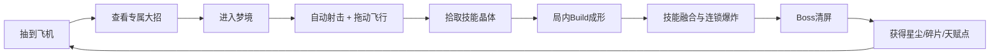
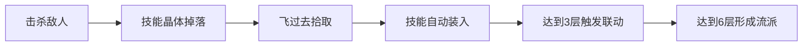
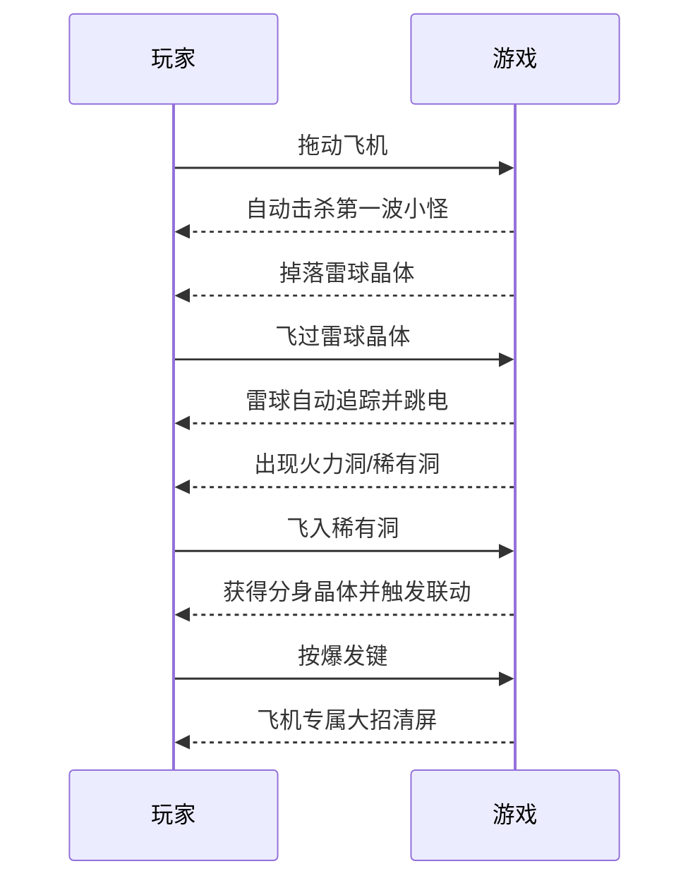

# 梦潮：回声航线

## 局内 Build 与局外成长策划文档 v0.4

版本：v0.4  
本版覆盖：v0.3 的成长、技能和爽感设计  
平台：Steam、Windows、Android、iOS  
核心类型：Q版 2D 自动射击 + 轻度构筑 + 飞行分岔

> 设计判断：玩家第二次打开游戏的理由，必须来自“这次我想试另一架飞机、另一条技能组合、另一棵随机天赋树”。一局结束后要留下期待，而不是只留下通关记录。

---

## 1. 新版本核心体验



玩家的记忆点只有四个：

| 记忆点 | 玩家感受 |
|---|---|
| 飞机不同 | “这架飞机的大招好帅。” |
| 组合不同 | “这次的雷电 + 分身太爽了。” |
| 天赋不同 | “下一局我要走另一条星盘。” |
| 一键爆发 | “按一次就清屏。” |

### 1.1 一局必须出现的爽点

```text
0—5秒：第一次击杀和小爆炸
15秒：第一次强化拾取
30秒：第一次技能联动
60秒：第一次一键清屏
90秒：第一次大规模连锁爆炸
3分钟：第一次Build成型
6—8分钟：Boss大招对轰和清场
```

任何一局如果只有平稳射击，没有上面至少三次明显升级，视为爽感不合格。

---

## 2. 操作设计：只有移动和一个爆发键

### 2.1 玩家操作

```text
拖动飞机 = 躲开攻击 + 飞向奖励 + 选择洞口
按爆发键 = 释放当前飞机专属大招
```

- 普通攻击自动完成。
- 局内技能自动完成。
- 护盾、吸附、回复由被动效果自动触发。
- 玩家不需要切换武器、不需要管理弹药、不需要按多个技能键。

### 2.2 一个操作带来多样性

同一个“爆发键”，根据飞机和局内 Build 产生不同结果：

| 当前飞机 | 同一个爆发键的结果 |
|---|---|
| 月兔号 | 放出巨型月轮，穿过敌人后分裂 |
| 糖果号 | 召唤彩虹糖雨，小怪直接变成糖果 |
| 星鲸号 | 吸入屏幕敌人，再吐出星尘海啸 |
| 纸飞机号 | 生成 5 个纸飞机分身，自动锁敌 |
| 闹钟号 | 时间暂停 2 秒，所有敌人被标记 |

技能晶体会改变大招的形态、数量、范围和联动方式，但不增加操作按钮。

### 2.3 操作验收

- 手机单手可以移动和释放爆发。
- Steam 手柄只使用左摇杆和一个主按钮。
- 玩家第一次使用爆发键就能看到明显的大画面反馈。
- 同一架飞机连续玩两局，因技能组合不同而有明显差异。

---

## 3. 飞机系统：抽卡获得，不做装备栏

### 3.1 飞机是主要收藏目标

飞机不是装备容器。每架飞机自带：

```text
基础攻击形状
专属大招
基础被动
随机天赋星盘
专属爆炸颜色
专属出场和击败演出
```

玩家只需要选择一架飞机出战，不需要给飞机穿装备、装配件、配芯片。

### 3.2 飞机稀有度

| 稀有度 | 定位 | 大招表现 |
|---|---|---|
| N | 入门飞机 | 直观、清屏、小范围 |
| R | 特色飞机 | 有一种明显玩法 |
| SR | 强演出飞机 | 大范围、带联动 |
| SSR | 招牌飞机 | 独特规则和专属Boss互动 |

稀有度影响演出和成长上限，不让低稀有度飞机失去可玩性。每架飞机都能完成基础区域。

### 3.3 首批飞机

| 飞机 | 视觉 | 专属大招 | 基础被动 |
|---|---|---|---|
| 月兔号 | 白色月灯兔 | 月轮清屏 | 月轮命中后回收梦尘 |
| 糖果号 | 粉蓝糖果飞机 | 彩虹糖雨 | 击杀有概率掉落糖果强化 |
| 星鲸号 | 深蓝小鲸鱼 | 星尘海啸 | 屏幕敌人越多，大招范围越大 |
| 纸飞机号 | 奶油纸张质感 | 五重分身 | 每拾取一次强化增加一架分身 |
| 闹钟号 | 金色圆闹钟 | 时间暂停 | Boss阶段切换时自动充能 |
| 云朵号 | 白云和小翅膀 | 云海冲撞 | 被攻击后生成缓冲云层 |

---

## 4. 抽卡系统：为了收集和尝试，不制造复杂负担

### 4.1 抽卡入口

```text
完成一局 → 获得梦灯券/飞机碎片
活动任务 → 获得梦灯券
区域Boss首通 → 获得指定飞机碎片
```

### 4.2 抽卡规则

| 规则 | 设计 |
|---|---|
| 单抽 | 1张梦灯券 |
| 十连 | 保底获得至少1个R或以上结果 |
| 重复飞机 | 自动转为该飞机碎片，不产生无用物品 |
| 碎片兑换 | 集齐指定数量可直接解锁飞机 |
| 保底 | 连续未出高稀有度时提高概率 |
| 新手 | 前10次内获得一架完整特色飞机 |

### 4.3 抽卡后的即时反馈

抽卡只展示一张大图、一段出场动画和一个专属大招预览按钮：

```text
飞机出现 → 大招预览 → “立即出战”
```

不显示复杂属性长表，不显示装备槽，不要求玩家配置。

---

## 5. 随机天赋星盘：局外成长的核心

### 5.1 星盘结构

每架飞机都有一棵独立星盘。星盘由四条视觉路线组成：

```text
        💥 爆炸
          │
🔥 火力 ──✦── 🧲 收集
          │
        🌈 大招
```

每条路线 5 个节点，共 20 个节点。玩家不需要研究复杂数值，只看图标即可。

### 5.2 随机规则

- 每架飞机解锁时，四条路线的节点从对应池随机生成。
- 节点只提供正向收益。
- 每局开始时随机点亮一条“本局幸运路线”。
- 玩家也可以在局外花费天赋点锁定想要的路线。
- 星盘布局随机，飞机之间不会出现完全相同的成长路径。

### 5.3 节点类型

| 图标 | 节点效果 |
|---|---|
| 🔥 | 普通攻击伤害增加 |
| 💥 | 爆炸范围增加 |
| 🌟 | 大招充能速度增加 |
| 🧲 | 强化吸附范围增加 |
| 🔁 | 技能触发后额外重复一次 |
| 👥 | 增加一架自动分身 |
| ❤️ | 最大生命增加 |
| 👑 | Boss阶段伤害增加 |

### 5.4 玩家决策量控制

局外每次只做一个选择：

```text
点亮一个大图标 → 立即获得收益
```

不出现 20 个数值对比，不要求重排节点，不加入洗点道具。

---

## 6. 局内 Build：用技能晶体自动长出来

### 6.1 Build目标

一局中至少获得 6 次技能变化，形成一个清晰的“流派”。玩家通过飞行拾取晶体完成选择，不打开选择页面。



### 6.2 技能槽结构

玩家永远只有 3 个局内技能槽：

| 槽位 | 触发方式 | 玩家操作 |
|---|---|---|
| 主技能 | 自动循环释放 | 无 |
| 联动技能 | 满层自动释放 | 无 |
| 爆发改造 | 按爆发键时加入大招 | 一个键 |

拾取新技能时，如果同类技能已经存在，会自动升级该技能；不打开背包、不拖拽、不排序。

### 6.3 技能流派

| 流派 | 核心技能 | 画面结果 |
|---|---|---|
| 雷暴流 | 雷球 + 连锁 | 敌人之间连续跳电 |
| 分身流 | 纸飞机 + 复制 | 画面出现多架小飞机 |
| 爆破流 | 标记 + 爆炸 | 一个敌人爆炸带走一片 |
| 吸星流 | 磁吸 + 星尘 | 整个屏幕的掉落物飞向玩家 |
| 彩虹流 | 彩色光束 + 糖果雨 | 颜色越来越多，清屏越来越快 |
| 冰晶流 | 冰晶 + 破碎 | 敌人冻结后一次性碎裂 |

### 6.4 技能等级

```text
1级：出现技能
2级：范围或数量增加
3级：附带第二种效果
4级：触发联动
5级：变成夸张版形态
```

同一技能升到 5 级时，要有明显的模型变化、音效变化和屏幕反馈。

### 6.5 技能联动公式

```text
雷球 + 标记     = 标记目标受到连锁雷击
分身 + 多重      = 每架分身各发一轮子弹
磁吸 + 爆炸      = 吸来的梦尘落地时爆炸
冰晶 + 彩虹      = 冰冻敌人碎裂后掉落彩色强化
Boss标记 + 大招 = 大招优先锁定Boss核心
```

技能联动只增加收益，没有负面条件，没有失败惩罚。

---

## 7. Build获取节奏

| 时间 | 事件 | 玩家感受 |
|---:|---|---|
| 0:10 | 获得第1个技能晶体 | “开始有变化了” |
| 0:35 | 获得第2个晶体 | 子弹形状改变 |
| 1:00 | 获得第3个晶体 | 第一次技能联动 |
| 1:40 | 获得第4个晶体 | 屏幕开始连锁爆炸 |
| 2:30 | 获得第5个晶体 | 大招出现特殊效果 |
| 3:20 | 获得第6个晶体 | Build流派成型 |
| 5:00 | 获得稀有晶体 | 进入夸张爽感阶段 |

原则：前 3 分钟一定形成 Build，不能让玩家玩完整局还只是“基础射击 + 两个技能”。

---

## 8. 爽点强化系统

### 8.1 连杀热度

连杀不是复杂计分，而是画面和奖励的放大器：

```text
10连杀  → 小爆炸
30连杀  → 屏幕边缘发光
50连杀  → 自动释放一次星环
100连杀 → 出现金色巨型强化
```

### 8.2 大招充能

大招通过击杀和拾取自动充能：

- 小怪：少量充能。
- 精英：大量充能。
- 连杀：额外充能。
- Boss暴露核心：快速充能。

充满后按钮只显示飞机头像和发光，不显示长文本。点击后直接进入专属大招演出。

### 8.3 清屏保护

大招释放时，屏幕短暂进入高亮状态，敌人和掉落物不会被误吞。大招结束后自动把奖励聚拢到飞机前方，让玩家继续飞。

---

## 9. 路线与Build结合

### 9.1 分岔洞口

战斗结束后，前方出现带图标的洞口。洞口不弹页面，玩家用移动直接选择。

| 洞口 | 对Build的影响 |
|---|---|
| ⚡技能洞 | 保证出现当前流派技能 |
| 🌟稀有洞 | 出现稀有技能晶体 |
| 👥分身洞 | 出现分身相关技能 |
| 💥爆破洞 | 出现爆炸相关技能 |
| 💰宝箱洞 | 获得星尘和天赋点 |
| 👑Boss洞 | 提前进入Boss，奖励提高 |

### 9.2 让玩家一眼看懂

洞口只显示“图标 + 颜色 + 运动特效”，不显示说明框：

```text
蓝色闪电洞 = 技能
金色星星洞 = 稀有
红色王冠洞 = Boss
绿色爱心洞 = 回复
```

### 9.3 无打断奖励

击败精英或Boss后，奖励会在飞行场景内漂浮。玩家飞向想要的图标即可领取，然后立刻进入下一段。

---

## 10. 局外成长循环

### 10.1 一局结束获得

```text
星尘：升级飞机天赋
飞机碎片：解锁和升星飞机
梦灯券：抽取新飞机
外观票：解锁爆炸颜色、拖尾和头像
```

### 10.2 局外三层成长

| 层级 | 内容 | 复杂度 |
|---|---|---|
| 飞机解锁 | 抽到新飞机 | 低 |
| 飞机星盘 | 点亮随机正向天赋 | 低 |
| 图鉴收藏 | 收集飞机、Boss、爆炸外观 | 低 |

不存在装备、强化材料套娃、重复配件、词条重铸、背包管理。

### 10.3 让玩家想开第二局

第一局结束时展示一张“下一局诱因卡”：

```text
本局：爆破流  █████
下一局：已解锁「星鲸号」专属大招
推荐路线：吸星洞 → 稀有洞 → Boss洞
```

只展示一张图和三个图标，让玩家马上知道下一局可以尝试什么。

---

## 11. 飞机成长与升星

### 11.1 升星收益

飞机重复抽取转为碎片，用于升星。升星只增强三类内容：

| 星级 | 收益 |
|---|---|
| 1星 | 解锁飞机和大招 |
| 2星 | 大招视觉升级 |
| 3星 | 解锁第二种大招联动 |
| 4星 | 星盘多一个随机节点 |
| 5星 | 解锁终极爆炸演出 |

### 11.2 不增加操作负担

飞机升星不会增加技能按钮，不会增加装备栏，不会要求玩家记住新规则。收益全部体现在更强、更大、更好看的反馈上。

---

## 12. Boss与Build回应

Boss要让玩家感觉自己的 Build 被看见了：

| Build | Boss回应 |
|---|---|
| 雷暴流 | Boss外壳导电，连锁次数增加 |
| 分身流 | Boss召唤镜像，分身自动锁定镜像 |
| 爆破流 | Boss护甲被标记，爆炸会打开核心 |
| 吸星流 | Boss掉落星尘海，磁吸流全部吸入 |
| 彩虹流 | Boss进入彩色狂欢阶段，奖励颜色变多 |

Boss不是单纯增加血量。玩家要看到自己的选择直接改变演出。

---

## 13. 美术与动效要求

### 13.1 爆炸等级

| 等级 | 触发 | 画面要求 |
|---|---|---|
| 1级 | 小怪死亡 | 小闪光 + 碎片 |
| 2级 | 连锁击杀 | 圆形冲击波 |
| 3级 | 技能联动 | 颜色扩散 + 屏幕轻震 |
| 4级 | 大招 | 角色特写 + 全屏光效 |
| 5级 | Boss死亡 | 清屏、巨大图标、奖励雨 |

### 13.2 视觉原则

- 画面中心永远能看见飞机。
- 爆炸必须比普通攻击大 1.5—3 倍。
- 技能升级必须有“变大、变多、变亮”至少一项。
- 洞口必须比背景亮，图标必须在 0.5 秒内识别。
- 特效允许夸张，但不遮挡下一次路线选择。

### 13.3 资源优先级

先制作能证明爽感的图片和动效：

```text
飞机大招 → 小怪爆炸 → 技能联动 → 洞口分岔 → Boss死亡 → 奖励雨
```

---

## 14. 重新定义的首局体验



首局结束时玩家应该说出：

```text
“下一局我要试另一架飞机。”
“下一局我要走分身流。”
“下一局我要把这个大招升到满级。”
```

---

## 15. 原型开发顺序

### P0：验证有没有爽点

1. 一架飞机：月兔号。
2. 一个大招：月轮清屏。
3. 三个局内技能：雷球、分身、爆破。
4. 一个技能联动：雷球 + 分身。
5. 普通小怪一发击杀。
6. 三个洞口分岔。
7. 连杀、爆炸、奖励雨。

### P1：验证局内Build

1. 6个技能晶体。
2. 3个技能槽自动循环。
3. 5级技能成长。
4. 3种Build流派。
5. 1个Boss回应Build。

### P2：验证局外成长

1. 5架飞机抽卡。
2. 每架飞机一棵随机星盘。
3. 星尘点亮天赋。
4. 碎片升星。
5. 首局结束推荐下一局目标。

### P3：内容扩充

1. 12架飞机。
2. 6个区域。
3. 8个Boss。
4. 20种局内技能。
5. 6种爆炸流派。

---

## 16. 数据验收标准

| 指标 | 目标 |
|---|---:|
| 首次击杀时间 | ≤5秒 |
| 首次技能获取 | ≤20秒 |
| 首次联动 | ≤60秒 |
| 首次大招 | ≤90秒 |
| 单局获得技能变化 | ≥6次 |
| 单局明显爽点 | ≥8次 |
| 普通小怪平均击杀时间 | ≤0.5秒 |
| 战斗段之间的空档 | ≤1.2秒 |
| 失败后重开时间 | ≤3秒 |
| 第二局点击率目标 | ≥55% |

如果测试玩家说“挺好看的，但没什么变化”，优先增加技能晶体、联动和大招反馈，不增加文字说明和复杂系统。

---

## 17. 版本决策

本版确定以下内容为商业版本主线：

```text
飞机抽卡
专属大招
随机天赋星盘
局内技能晶体
自动技能联动
一个移动操作 + 一个爆发键
飞行分岔洞口
全部正向强化
无装备栏
无复杂背包
无战斗后选卡弹窗
```

完整 Q 版资源规范见：[梦潮回声航线-美术风格规范-Q版.md](D:/小游戏/梦潮回声航线-美术风格规范-Q版.md)。

