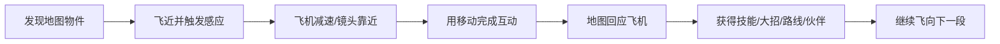
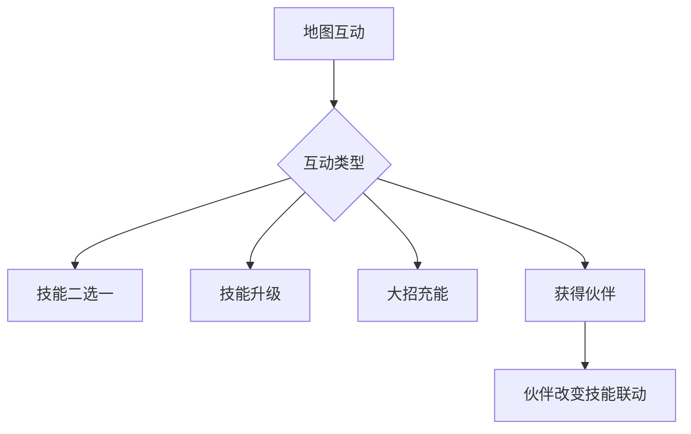

> 来源：用户 2026-09-24 在对话里直接贴出的全文（本机没有原文件），内容未改动。

# 梦潮：回声航线

## 飞机—地图交互创新策划 v0.6

版本：v0.6  
定位：商业版本核心创新方向  
适用范围：第一章原型、地图设计、飞机控制、NPC、互动奖励、美术表现

> 核心判断：地图不能只是飞机飞过的背景。玩家要感觉自己真的在驾驶这架梦灯飞机，靠飞行路线、停留位置和尾流去打开、修复、唤醒和改变梦境世界。

---

## 1. 核心卖点

```text
别人：飞机在地图上打敌人
本作：飞机和地图发生关系，地图会回应飞机
```

玩家的核心体验是：

```text
我飞近一座房子 → 房子亮起来
我绕着矿石飞 → 矿石被唤醒
我穿过一串光环 → 断桥重新出现
我停在NPC身边 → NPC跟着我的飞机出发
我改变飞行路线 → 梦境地图真的发生变化
```

这套体验比单纯增加武器、装备、数值更容易形成记忆点，也更适合做宣传视频和短截图传播。

---

## 2. 交互总循环



每个互动都遵守同一套节奏：

```text
看见 → 接近 → 停留或绕行 → 地图回应 → 奖励飞回飞机
```

不打开菜单、不切换模式、不使用复杂按键。

---

## 3. 飞机与地图的四种关系

### 3.1 接近关系：飞近就会回应

飞机进入物件感应范围后，地图自动亮起：

| 地图对象 | 飞近后的回应 |
|---|---|
| 梦灯屋 | 窗户亮起，门打开 |
| 沉睡NPC | 眼睛睁开，漂浮靠近 |
| 星砂矿 | 矿脉沿飞机方向发光 |
| 断桥 | 缺口出现引导箭头 |
| 巨型植物 | 花瓣朝飞机转动 |

玩家不需要读说明，就知道“这里可以互动”。

### 3.2 停留关系：飞机成为地图的一部分

玩家在物件附近保持位置，飞机的灯光和尾流会持续充能物件：

```text
停留 0.5秒：物件开始发光
停留 1.5秒：出现充能环
停留 3秒：互动完成，地图发生变化
```

飞机停留时，敌人密度降低，避免玩家因参与互动而感觉被惩罚。

### 3.3 路径关系：飞行轨迹改变地图

地图中出现需要沿路线完成的互动。玩家只控制飞机移动，尾流自动留下光线。

```text
飞机穿过 A 环 → B 环 → C 环
尾流连成完整路线
地图结构被唤醒
```

路径互动适合修桥、点灯、开门、唤醒巨型生物。

### 3.4 伙伴关系：NPC会跟着飞机

玩家完成互动后，NPC不只是发奖励，而是加入本局：

```text
NPC被唤醒 → 跟随飞机 → 自动提供效果 → 到达Boss前进行一次帮助
```

NPC可以变成小飞机、拖尾、护盾、自动炮台或大招改造。这样玩家会记住“我救了谁、谁跟着我飞”。

---

## 4. 互动界面：图像代替文字


地图物件使用三层视觉提示：

| 层级 | 表现 | 目的 |
|---|---|---|
| 远处 | 彩色剪影和发光点 | 让玩家发现 |
| 接近 | 感应环、方向箭头 | 告诉玩家可以互动 |
| 可完成 | 充能圈、图标放大 | 告诉玩家正在生效 |

文字只保留必要的奖励名称，例如“技能”“大招”“伙伴”，每个不超过 2—4 字。

---

## 5. 第一章互动地图结构

第一章不是战斗段之间随机插入互动，而是把互动点写进地图路线：

```text
起飞海湾
  ↓
梦灯屋
  ↓
鱼群通道
  ↓
断桥
  ↓
星砂矿
  ↓
睡眠NPC
  ↓
闹钟Boss巢穴
```

玩家会因为“我要去那座房子”“我要救那个NPC”而继续飞，不只是因为下一波敌人出现。

### 5.1 推荐分布

| 位置 | 互动 | 互动价值 |
|---|---|---|
| 0:30 | 梦灯屋 | 第一次技能二选一 |
| 1:30 | 断桥 | 开启奖励捷径 |
| 2:30 | 星砂矿 | 大招充能/天赋点 |
| 3:30 | NPC | 获得本局伙伴 |
| 4:40 | 巨型植物 | 触发一次地图清场 |
| 5:30 | Boss门 | 进入Boss并补充大招 |

---

## 6. 互动一：梦灯屋转盘

### 6.1 场景表现

梦灯屋漂浮在云海中，窗户没有灯。飞机飞近后，房子主动转向玩家，屋顶亮起一圈灯。

### 6.2 玩家操作

```text
飞近 → 保持在屋前 → 飞机尾灯充能 → 转盘转动 → 奖励飞出
```

玩家只控制位置，不按第二个按钮。

### 6.3 奖励

| 图标 | 奖励 |
|---|---|
| ⚡ | 大招充能 +1 |
| 🌟 | 立即出现技能二选一 |
| 💥 | 当前技能释放一次强化版 |
| 🛡 | 生成一次自动护盾 |
| 🧲 | 当前局吸附范围提升 |

### 6.4 代入感重点

玩家会看到“自己的飞机把一座黑暗房子点亮”。奖励不是凭空弹出，而是从房子里飞出来。

---

## 7. 互动二：断桥修复

### 7.1 场景表现

前方道路断开，桥的三段灯环分别漂浮在空中。玩家飞过三段灯环，飞机尾流会把它们连接起来。

### 7.2 玩家操作

```text
调整飞行路线 → 穿过三段灯环 → 尾流连线 → 桥梁完整出现
```

### 7.3 成功奖励

- 开启一条安全路线。
- 直接跳过一波小怪。
- 生成两个技能门。
- 获得一个正向 Build 选择。

### 7.4 失败处理

玩家错过灯环不会死亡，只是断桥保持关闭，飞机继续前进。下一次路线仍可能再次遇到修复点。

---

## 8. 互动三：星砂矿挖掘

### 8.1 场景表现

星砂矿像一颗漂浮的小行星，表面有裂缝。飞机接近后，裂缝会沿飞机灯光方向扩大。

### 8.2 玩家操作

```text
停在矿点附近 → 保持位置 → 充能圈转满 → 矿石爆开
```

互动过程中可以看见裂缝、碎石和星砂，不使用复杂进度文字。

### 8.3 奖励

- 星尘天赋点。
- 大招充能 +1。
- 稀有技能门。
- 飞机拖尾外观。

### 8.4 爽感重点

挖矿完成必须不是小数字跳出，而是一次小型清屏爆炸：矿石碎开，星砂像瀑布一样吸入飞机。

---

## 9. 互动四：NPC救援与跟随

### 9.1 NPC被困

NPC被困在泡泡、藤蔓或钟表齿轮中。玩家靠近后，地图出现一个简单的移动目标：

```text
绕着泡泡飞一圈 → 泡泡破裂 → NPC加入队伍
```

### 9.2 NPC效果

| NPC | 跟随效果 |
|---|---|
| 小梦兔 | 自动拾取技能门附近的奖励 |
| 云朵爷爷 | 被攻击时生成缓冲云 |
| 星星矿工 | 每击杀一行敌人掉落星砂 |
| 糖果商人 | 技能升级时额外生成糖果爆炸 |
| 小闹钟 | Boss阶段开始时补充1次大招 |

### 9.3 代入感重点

NPC会在飞行过程中做小动作：挥手、打瞌睡、追着奖励跑、在Boss出现时躲到飞机后面。玩家会觉得它是旅伴，而不是一个菜单按钮。

---

## 10. 互动五：巨型梦境生物

地图中偶尔出现不会立即攻击玩家的巨大生物，例如睡鲸、云龟、花海鹿。

玩家可以：

```text
飞到眼睛附近 → 触发回应 → 巨型生物改变航线 → 帮玩家清掉一波敌人
```

它们不是Boss，也不是必须击败的敌人，而是地图中的“活景观”和短期伙伴。

示例：

| 生物 | 互动后效果 |
|---|---|
| 睡鲸 | 吸走前方敌人和弹幕 |
| 云龟 | 展开背甲，生成安全航道 |
| 花海鹿 | 撒下彩色强化花瓣 |
| 月亮兔 | 让下一座技能门变成稀有选择 |

---

## 11. 互动与技能 Build 的关系

互动不是独立小游戏，而是 Build 获取的重要途径：



### 11.1 互动不会给随机废物

系统根据当前 Build 生成奖励：

- 已有雷球时，矿点优先给雷球升级或分身联动。
- 已有分身时，NPC优先给大招复制或射速强化。
- Build缺少范围能力时，梦灯屋优先给爆破或彩虹束。

这样玩家会觉得地图在“帮助我完成流派”，而不是随便扔一个无关奖励。

---

## 12. 互动与战斗的衔接

地图互动不能让战斗变成割裂的两个模式。互动结束后必须把效果带回战斗：

| 互动完成 | 进入战斗时的即时效果 |
|---|---|
| 梦灯屋 | 第一波敌人出现时自动释放强化技能 |
| 断桥 | 进入下一段时少一行敌人 |
| 星砂矿 | 第一轮连杀充能更快 |
| NPC救援 | NPC立刻加入射击或吸附 |
| 巨型生物 | 前方一屏敌人被清掉 |

玩家不会觉得“刚才做了一个小游戏，现在又重新开始”。地图行为会马上转化成战斗优势。

---

## 13. 互动节奏控制

| 规则 | 数值 |
|---|---:|
| 互动点最短间隔 | 35秒 |
| 互动点最长间隔 | 80秒 |
| 单次互动时间 | 1.5—5秒 |
| 一个区域互动数量 | 4—6个 |
| 连续互动上限 | 2个 |
| 互动后战斗空档 | ≤1.2秒 |

互动要让玩家产生“我在探索”，但不能让玩家忘记 Build 和清怪目标。

---

## 14. 地图交互的宣传画面

首批宣传素材必须展示“飞机正在改变地图”，而不是只展示开火：

```text
图1：飞机点亮梦灯屋
图2：飞机尾流修复断桥
图3：飞机环绕星砂矿，矿石爆开
图4：NPC跟在飞机后面穿过云海
图5：巨型睡鲸睁眼，前方敌人被吸走
图6：飞机飞进技能门，技能大图标爆开
```

宣传语方向：

```text
飞到哪里，梦境就改变到哪里。
你的飞机不是经过地图，它正在唤醒地图。
```

---

## 15. 原型优先级

### P0：验证核心创新

1. 飞机接近物件后物件亮起。
2. 飞机停留 2 秒完成互动。
3. 尾流穿过 3 个环修复断桥。
4. 互动完成后奖励飞回飞机。
5. 互动奖励立即改变 Build 或大招。

### P1：完成第一章互动路线

1. 梦灯屋转盘。
2. 断桥修复。
3. 星砂矿。
4. NPC救援和跟随。
5. 巨型梦境生物。

### P2：扩展飞机专属互动

每架飞机对地图有一项特殊反应：

| 飞机 | 专属地图反应 |
|---|---|
| 月兔号 | 月光物件提前亮起 |
| 糖果号 | 互动奖励变成糖果爆炸 |
| 星鲸号 | 可以吸走矿点周围的星砂 |
| 纸飞机号 | 尾流会留下多个充能点 |
| 闹钟号 | 互动完成后时间短暂停止 |

---

## 16. 验收标准

| 测试问题 | 合格标准 |
|---|---|
| 玩家能否发现互动点 | 3秒内看见发光对象 |
| 玩家是否理解怎么触发 | 飞近后自然停留或绕行 |
| 互动是否有代入感 | 玩家能说出“我点亮/修复/救出了什么” |
| 互动是否影响Build | 至少改变技能、大招或伙伴一项 |
| 互动是否打断节奏 | 单次不超过5秒，完成后马上继续 |
| 互动是否有爽点 | 必须有爆炸、喷射、地图变化或伙伴加入 |
| 玩家是否愿意探索 | 首章至少主动触发3次互动 |
| 玩家是否记住飞机差异 | 能说出该飞机的专属地图反应 |

如果测试玩家只说“地图挺好看”，说明互动没有真正改变地图；如果玩家说“我想再飞回去救那个NPC”，说明代入感成立。

---

## 17. 本版最终结论

```text
飞机移动是唯一核心操作
地图物件会发现飞机、回应飞机、改变状态
飞行路线本身就是互动方式
停留、绕行、穿环都只依赖移动
互动直接影响技能Build、大招和伙伴
NPC会跟随飞机，形成旅途关系
巨型生物是可互动的活地图
地图不是背景，而是可以被玩家唤醒的对象
```

当前商业版本主设计文档：

[梦潮回声航线-飞机地图交互创新策划-v0.6.md](D:/小游戏/梦潮回声航线-飞机地图交互创新策划-v0.6.md)
