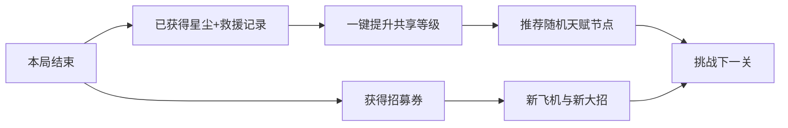

# 梦潮：回声航线｜射击成长、关卡推进与商业化 v0.7

日期：2026-09-27  
状态：设计方案，数值为原型调试起点；尚未修改游戏代码，也未证明留存或付费效果。

> 本版是射击、奖励、关卡、局外成长与商业化的最新执行依据。地图交互沿用 v0.6，技能二选一沿用 v0.5；发生冲突时按本版执行。核心体验仍是“移动飞机改变地图，地图帮助我完成 Build”。

## 1. 本次定案

| 开局 | 局内获取 | 局外保留 |
|---|---|---|
| 自动开火、固定朝前 | 穿透、追踪、分裂、连锁 | 飞机、等级、随机天赋树 |
| 单发单体、命中消失 | 升级二选一、地图奖励抽奖 | 章节进度、大招容量 |
| 无自动瞄准、无转向 | 本局逐步搭配技能 | 外观、NPC救援记录 |

一句话：**开局靠站位清一列，穿透清一行纵深，追踪扫散兵，组合后收割整片。**

“自动开火”和“自动追踪”必须分开。玩家无需按射击键，但必须通过移动对准敌人；初始子弹不能悄悄改变方向。所有飞机遵循此规则，稀有飞机也不能跳过局内获取。

## 2. 基础射击：把成长空间留出来

### 2.1 可直接实现的规则

| 项目 | 初始规则 |
|---|---|
| 朝向 | 横版默认向屏幕右侧，发射方向始终固定 |
| 瞄准 | 不搜索最近敌人，不自动转炮口，不补偿敌人位置 |
| 轨迹 | 直线匀速；可视拖尾不改变碰撞路径 |
| 命中 | 命中首个有效敌人即销毁 |
| 穿透次数 | 0 |
| 追踪能力 | 关闭 |
| 基础伤害 | 10 |
| 基础射速 | 8 发/秒 |
| 第一关普通杂兵生命 | 8 |
| 弹体宽度 | 适当宽，降低手机对准难度；不暗中扩成追踪 |
| 伤害反馈 | 命中即爆，小怪死亡不做长受击硬直 |

以上数字用于验证“单个敌人死得快，但成队敌人需要清理”。后续通过击杀时间和波次积压调参，不能只看面板战力。

### 2.2 边界条件

- 子弹未命中：飞出战斗区或到达寿命后回收。
- 敌人死亡：已发射的普通子弹保持原方向。
- 选择奖励期间：不自动为玩家补上追踪。
- 分身和僚机：基础发射同样朝前，继承已经选择的主炮改造。
- 大招：可以保留飞机专属全屏、范围或吸引表现，但不能永久给普通子弹追踪/穿透。
- 飞机等级和天赋：可以提高已获得追踪的转向表现、已获得穿透的次数，不能在没有相应升级时激活能力。
- 新一局：清除局内追踪、穿透和分裂，保留局外等级、树与容量。

## 3. 两张值得期待的核心奖励

| 奖励 | 1级 | 2级 | 3级 | 可见变化 |
|---|---|---|---|---|
| 穿透 | 同一弹体最多命中2个不同敌人 | 最多命中3个 | 最多命中4个 | 弹头拉长，贯穿后留下短光轨 |
| 追踪 | 射出的子弹可缓慢转向前方目标 | 转向更快、搜索角更大 | 目标死亡后可重新找前方敌人 | 子弹尾迹弯曲，有清晰转向 |

原型转向速度：追踪1/2/3级为 90/150/210 度每秒；搜索半角为 35/50/65 度。它们是可调参数，不是最终平衡值。

### 3.1 穿透判定

穿透不自带伤害衰减，保持升级获得感；每颗弹体记录已命中敌人，同一敌人最多受该弹体一次伤害。次数用尽、出界或到寿命时回收。穿透撞击不可破坏地形时终止，除非未来另做明确升级。

### 3.2 追踪判定

获取能力后才启用目标搜索。优先选择前方搜索范围内最近的有效敌人。1—2级目标丢失后沿当前方向直飞，3级允许再次搜索；禁止原地绕圈和无限追逐。无目标时仍朝前射击。

### 3.3 两者搭配

先追踪后穿透：先转向命中敌人，再继续穿过后续目标。拥有追踪3级时，贯穿后可搜索未命中的前方目标。弹体寿命仍受上限约束。

**穿透处理成队敌人，追踪处理散兵；两者都好用，不把任何一个做成通关唯一答案。**

## 4. 奖励流程：期待 → 二选一 → 成型 → 验证

- 清波奖励：显示下一次选择的轮廓预告，达成清怪目标后揭晓。
- 房屋转盘：转动决定“本次两个候选”，然后仍由玩家二选一；转盘不直接替玩家决定技能。
- 挖矿奖励：裂缝透出两个技能颜色，矿石爆开后显示两个候选。
- NPC奖励：NPC搬出两个技能样机，靠近其一可看短演示。
- 大招充能、恢复等纯资源奖励可直接发放；新技能和改变流派的升级必须经过选择。

一次过程：预告0.5秒，揭晓0.6秒，选择窗口默认4秒，确认演出0.5秒。选择时敌人停止新攻击，已有危险淡出，场景以慢速持续前进；不弹全屏选卡页。选择区域内单独减慢世界滚动，飞机操控速度保持可用。

### 4.1 误选和错过处理

接近仅预览，进入候选确认圈并停留0.35秒才选择。奖励双门与路线洞口使用不同边框，避免误认。另一个方案关闭后立即继续飞。

没有选中：奖励机会记账，下一段安全位置再次出现；不替玩家随机选，不要求返回地图。开始第一次选择时用移动箭头演示一次。

### 4.2 公平奖励池

| 时间/条件 | 候选生成规则 |
|---|---|
| 首次选择，约20—30秒 | 固定“穿透1 / 追踪1”，让玩家立刻体验基础子弹升级 |
| 第二次选择 | 一个已有方向的升级 + 一个兼容新方向 |
| 第三次选择 | 保证至少一个能与已有技能联动的方案 |
| 连续2次没有可提升项 | 下一次强制提供兼容升级或未满级核心技能 |
| 能力满级 | 移出同名升级池，避免空奖励 |
| 两个方案 | 不重复；互斥、无作用、需要未拥有前置的方案不直接投放 |

随机来自“这次给哪两个好东西”，玩家决定自己的 Build。商业支付、观看广告次数和付费历史不参与候选权重。

### 4.3 简化槽位，防止升级相互挤占

沿用“最多三个可见技能图标”，但统一为：
1. 主炮改造链：穿透、追踪、多重等；兼容效果累积，不占满就替换。
2. 自动支援：雷球、分身等；满槽出现新支援时，二选一明确展示替换前后。
3. 大招改造：改变当前飞机大招的联动。

主炮图标点击后可在暂停页展开图鉴，战斗中只显示最高阶造型。获得穿透之后再选追踪不会覆盖穿透。

### 4.4 两条实际成长示例

| 选择 | 贯穿爆破流 | 追踪蜂群流 |
|---|---|---|
| 第1次 | 穿透1 | 追踪1 |
| 第2次 | 穿透2 | 分身1 |
| 第3次 | 标记爆破 | 追踪2 |
| 第4次 | 多重2路 | 分身2 |
| 第5次 | 贯穿终点爆炸 | 蜂群同步开火 |
| 爽点 | 一道火线清掉成排敌人 | 飞机与分身扫掉四处分散的敌人 |

选完之后下一波加入少量适合演示的敌阵，但不削弱原有挑战、不强制玩家选指定技能。未选穿透仍可用爆破/多重清队，未选追踪仍可用宽弹道/分身处理散兵。

## 5. 飞机与地图交互仍是主角

地图交互承担“看到机会、参与开奖、拿到 Build、改变下一段地图”四个职责。

| 物件 | 一个移动操作 | 地图变化 | Build回报 |
|---|---|---|---|
| 梦灯屋 | 靠近悬停2秒 | 黑暗房屋亮灯、屋顶转盘启动 | 两个主炮改造方案 |
| 星砂矿 | 停在灯圈2.5秒 | 矿层裂开，矿道开启 | 两个兼容强化方案 |
| 救援站 | 飞过宽光环救NPC | NPC跟随，开启后续支援点 | 支援技能二选一 |
| 风力塔 | 飞入风圈充能2秒 | 风路改变，打开隐藏航道 | 路线末端稀有二选一 |
| 古钟台 | 贴近钟摆感应区 | 钟台震荡清掉一队敌人 | 大招进度或次数 |

原型只做房屋、矿点、NPC三种，其余作为扩展。悬停期间自动射击继续，附近不刷新敌人；物件提供可见防护圈，不能让玩家因操作地图而被不可见伤害打断。

重复游玩用地点、候选和后续路线变化制造差异；不要求画精确圆圈，不增加小游戏按键，不让每次互动都变成同样的读条。NPC反应、转盘、爆矿分别提供不同的视觉节奏。

## 6. 章节、关卡、波次统一定义

- 章节：一个美术主题，含3个关卡。
- 关卡：一次完整出击，约6—8分钟，结束Boss后结算。
- 波次：关卡内部连续出现的敌阵。
- 路线：关卡内飞向洞口选择战斗、互动或补给。
- 结算：只在一次出击结束时出现；波次、洞口、地图互动之间不出现结算页。

本次先做第1章3关的成长闭环，第2章3关用于长期数值预演。关卡通关解锁下一关，失败保留本局已结算成长资源。下一关从新局基础射击开始，追踪和穿透重新构筑。

## 7. 每关更强，但杂兵依然容易死

### 7.1 调整顺序

先增加队列数量、出兵频率和混合阵型，再引入精英和地图威胁，最后微调生命。每关都提高总压力，同时保留几秒供玩家展示新技能的低压窗口。

固定关卡难度，不根据付费、装备或当前等级偷偷提高敌人生命。玩家回打旧关时，应明显感到自己变强。

### 7.2 六关原型标尺

以下为方案值，“有效清怪能力”需通过实机单位时间击杀测量；敌阵与命中率会影响结果。

| 关卡 | 杂兵HP | 峰值出兵/秒 | 精英配置 | 建议共享等级 | 相对局外攻击 | 大招容量目标 |
|---|---:|---:|---|---:|---:|---:|
| 1-1 | 8 | 9 | 首次小队长 | 1 | 1.00 | 1 |
| 1-2 | 9 | 11 | 队长+散兵 | 2 | 1.06 | 2 |
| 1-3 | 10 | 13 | 护卫编队+章Boss | 3 | 1.12 | 2 |
| 2-1 | 11 | 15 | 快速侧翼+队长 | 4 | 1.19 | 2 |
| 2-2 | 12 | 17 | 两种精英交替 | 5 | 1.26 | 3 |
| 2-3 | 13 | 19 | 双队长+章Boss | 6 | 1.34 | 3 |

共享攻击参考公式：基础伤害 × 1.06^(等级−1)，原型上限10级，伤害计算保留小数。表内生命用于保持推荐等级下基础杂兵约一发死亡；精英和装甲单位承担持续输出需求。建议等级只是提示，不锁关。

后期每关的峰值数量不是整局恒定数值。热身、压力、强化验证、休整、高潮交替，避免从头到尾都堆满屏。

### 7.3 防止“出得比打得快”变成必输

定义积压量 = 累计生成敌人数 − 已击杀数 − 已自然离场数。

- 开局1-1平均出兵约5只/秒，峰值9只/秒持续3秒；基础射速8发/秒，不代表一定命中8只。
- 获得范围升级前，峰值只短暂超过实际清怪能力，随后给清理窗口。
- 同屏活跃敌人达到调试上限48只时暂停新队列入场，队列保留；上下仍留移动空间。
- 积压超过24只持续3秒，推迟下一队并显示可利用地图设施；不凭空送核心技能。
- 暂停入场不减少本波目标，不影响奖励。玩家仍需要主动清掉积压。
- 建议Build下精英击杀约2—5秒、Boss约45—75秒，超过目标优先检查输出机会和命中率。

生命耗尽才失败；普通敌人漏过只损失本波额外评分，不触发连续扣血雪崩。主目标优先是击破队长/消灭指定编队，逃逸单位不计入不可完成的清零计数。

## 8. 局外成长：一个主按钮，三种进步

### 8.1 共享成长

星尘用于共享等级，所有飞机受益。起始伤害、生命小幅增长，新抽到飞机可立即进入当前进度，不从零重新刷材料。无需装备、洗词条、配件、属性重铸。

原型经济锚点：首关成功获得约120星尘，2级费用100；后续升级费用160/220/280/340。失败按已完成波次结算约30—90，具体与过关进度关联。数值只用于确认首局能完成一次成长。

目标：推荐Build下，前3关可用首通收入继续推进；失败1—2局也能完成一次有意义提升。不能为了制造购买需求而故意把过关成本抬高。

### 8.2 飞机随机天赋树

每架飞机解锁时生成一次并保存，不每次进游戏重随机。随机的是正向节点排列和分支组合，不随机重要功能是否存在。

- 每次升级默认高亮一个推荐节点；玩家可直接确认，也可改选相邻节点。
- 节点样例：已获穿透额外命中+1、已获追踪转向+15%、房屋充能更快、NPC辅助时间增加。
- 未获得相应局内能力时，相关节点保持待激活；选择该能力后明显亮起。
- 提供基础通用节点，不能让随机树把整架飞机变成无用角色。
- 大招容量是树中的固定里程碑，不进入随机节点池，也不依赖付费抽到好树。
- 不售卖天赋重随机，不建立刷完美树的养成负担。

### 8.3 大招容量进程

初始1次；1-1首次完成后解锁第一个固定容量节点，最高2次；1-3首次完成后解锁第二个容量节点，最高3次。容量里程碑账号共享，新飞机继承。

每次释放消耗1次；从击杀和地图互动继续积累。UI显示“已存次数/容量”和下一次进度，储存2次后仍可继续填第三次。容量已满时多余能量只转为少量本局积分，不扩大隐藏库存。

首次教程约45秒给到一次完整充能，随后展示矿点能再充能；Boss入口仅在库存0时补到1，不把1次补成2次。用供给可预期来鼓励使用，避免新手把大招一直留住。

### 8.4 失败后的新目标

结算只显示三个可操作内容：“这次已攒够升级”“下次想完成的Build”“继续挑战关卡”。重复失败可选择回打已开关卡，地图位置和候选变化；没有体力限制、定时等待或失败购买弹窗。

## 9. 飞机抽卡与升级抽奖必须分开

| 系统 | 发生地点 | 消耗 | 产出 | 持续时间 |
|---|---|---|---|---|
| 飞机招募 | 局外机库 | 游玩获得的招募券 | 新飞机/重复碎片 | 永久 |
| 技能二选一 | 局内安全航段 | 清波或互动机会 | 穿透、追踪与联动 | 本局 |
| 地图转盘 | 房屋等物件 | 一次参与，无货币支付 | 技能候选/能量/恢复 | 本局 |

首版飞机招募保留抽取演出，招募券以首通、救援和游玩目标获得。第1章内保证可试第二架飞机。重复飞机自动转进指定飞机解锁进度，不增加新材料类型。

首版不售卖随机数值飞机抽取。若将来决定做付费招募，需要单独确认商业方案、重新做成长及相关发行审核，不能顺手把已设计的免费抽取按钮接上支付。

## 10. 商业化：让用户为喜欢的内容付费

以下是本项目的商业设计建议，不是平台收费政策、收入预测或已验证商业结论。首轮不确定售价，先验证玩法和复玩。

| 端 | 首发建议 | 玩家买到什么 | 与成长的关系 |
|---|---|---|---|
| Steam | 买断基础游戏 + 后续外观/实质内容扩展 | 完整基础章节、飞机与成长；可选新内容 | 基础Build与容量通过游玩获得 |
| 手机 | 免费体验第1章 + 一次性完整解锁 | 后续章节与完整游玩内容 | 解锁内容，不购买跳过单关能力 |
| 两端 | 明码标价外观包 | 飞机涂装、座舱表情、尾焰、互动演出主题 | 不改变伤害、概率、奖励或容量 |

这是一套内容销售优先的首发方案。手机完整解锁边界应在开始体验前说明，不能等玩家失败时才突然提示付款。后续内容扩展可以增加章节、Boss与地图设施，基础已购买内容持续可玩。

### 10.1 地图交互也能承载外观价值

- 飞机靠近房子时，所选尾焰点亮屋顶颜色。
- 矿石爆开时，外观主题改变星砂形状和收集动画。
- NPC救援后，跟随伙伴使用对应表情和拖尾。
- 转盘外观只换主题，不改变奖池、中奖率或停留时间。
- 购买预览在机库安全场景演示，不在战斗和地图互动中显示购买按钮。

普通玩家也必须有完整的亮灯、爆矿、救援和大招演出。付费提供不同审美，不删除免费版的关键反馈。

### 10.2 明确禁区

不卖局内追踪、穿透、不售卖“本次必出某技能”、不靠广告重抽二选一、不卖第2/3次大招容量、不售卖过关必需属性、不在战斗中弹促销。首版不做广告、战令和每日强制签到，避免在玩法尚未验证时增加界面负担。

### 10.3 商业方案与关卡平衡的隔离

标准关卡由“免费游玩成长+普通奖励池”通关后才验收。付费外观账号和无外观账号使用同一数值表和随机规则。支付状态不进入掉落生成器、敌人属性计算和关卡解锁条件（内容包所有权除外）。

## 11. 程序落地清单

| 模块 | 必须修改 | 验收方式 |
|---|---|---|
| 基础弹体 | 初始 homing=false、pierce=0，固定向前 | 射击偏离目标时不得拐弯；第一命中后消失 |
| 能力应用 | 只由已确认选择激活追踪/穿透 | 奖励预览不生效，确认后立刻生效 |
| 命中记录 | 一颗弹体不重复伤害同一目标 | 穿过大型敌人只结算一次 |
| 抽奖候选 | 两个可用且不同的方案，落实保底 | 满级/互斥项不浪费候选 |
| 地图互动 | 物件感应、参与、开奖、地图变化 | 完成后既有场景变化也有奖励 |
| 章节配置 | 每关独立配置，不偷偷随玩家成长抬难度 | 回打旧关明显更轻松 |
| 敌群调度 | 队列、数量上限、积压恢复 | 屏满时不无限刷新、不丢主目标 |
| 存档 | 飞机树种子、等级、容量、章节与救援记录 | 重进不重抽树，局内能力不误带到新局 |
| 商业接口 | 外观/内容所有权与战斗数值隔离 | 购买外观前后相同种子的战斗规则一致 |

数据字段建议：ProjectileBase / RunModifiers / AircraftTalentSeed / SharedGrowth / ChapterStage / RewardOffer / UltimateStock。局内和永久状态分开存储，防止追踪被意外永久保留。

## 12. 测试与交付范围

第一轮：1架飞机、1章3关、穿透/追踪/多重/爆破4种改造、房屋/矿点/NPC三种交互、1—3次大招容量及基础成长。商业只做机库外观预览和完整解锁流程原型，未确认发行方案前不接真实支付。

重点验证：

- 未取得升级时，基础子弹在所有飞机与所有关卡均不追踪、不穿透。
- 第一次二选一后，玩家能看到并说出攻击行为变化。
- 两种首选都能打通第1章，不出现必须选穿透才能通关。
- 每关的清怪压力递增；普通杂兵仍短时死亡，精英和Boss提供持续目标。
- 失败后获得成长，回到同关后能更快处理相同敌阵。
- 到达首个容量节点后，玩家大招使用是否更频繁；记录库存满而不使用的时长。
- 地图互动主动参与率、技能选择耗时、平均过关次数按关卡单独看。
- 付费意愿与玩法满意度分开调查；不把目标留存率或购买率写成已实现结果。

## 13. 文档关系

本版：射击默认值、奖励获取、章节推进、永久成长、商业化。  
[v0.6 地图交互](D:/小游戏/梦潮回声航线-飞机地图交互创新策划-v0.6.md)：场景物件和飞机的关系。  
[v0.5 Build与波次](D:/小游戏/梦潮回声航线-技能Build与第一章节奏深化策划-v0.5.md)：二选一与清怪体验参考。  
[v0.4 飞机与天赋](D:/小游戏/梦潮回声航线-大众爽游方向策划文档-v0.4.md)：飞机创意参考，成长执行本版。

最终体验链：**直射开局 → 操作地图开奖 → 二选一获得穿透/追踪 → 清怪方式变强 → 挑战更强关卡 → 局外成长 → 换飞机再构筑。**
